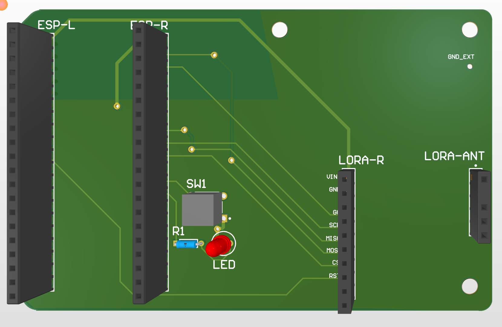
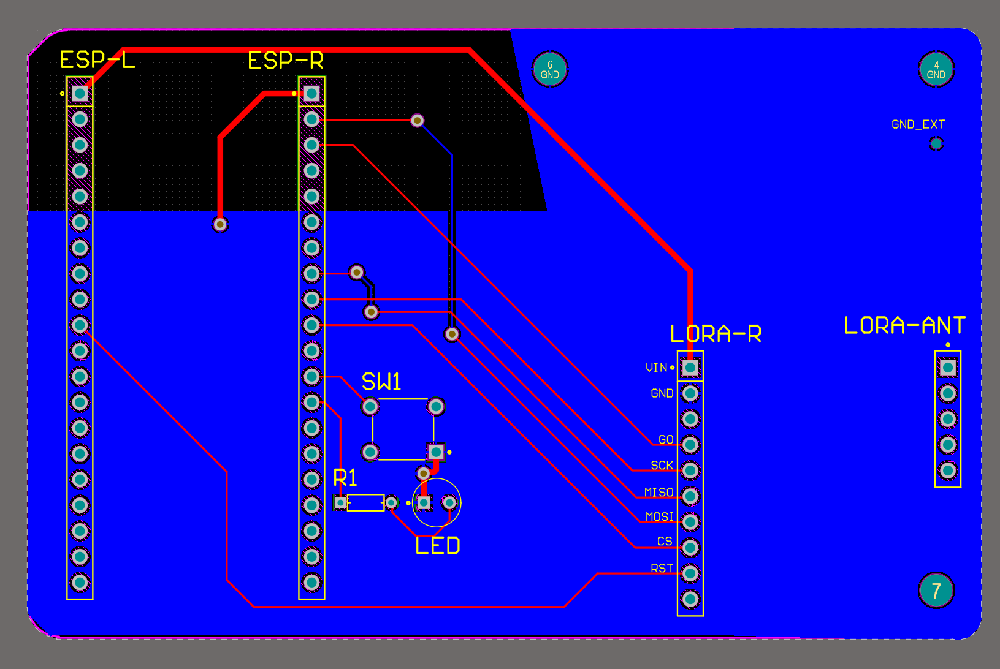
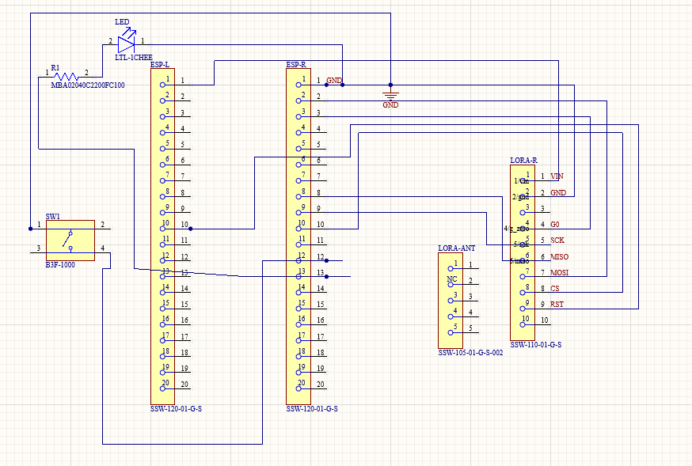
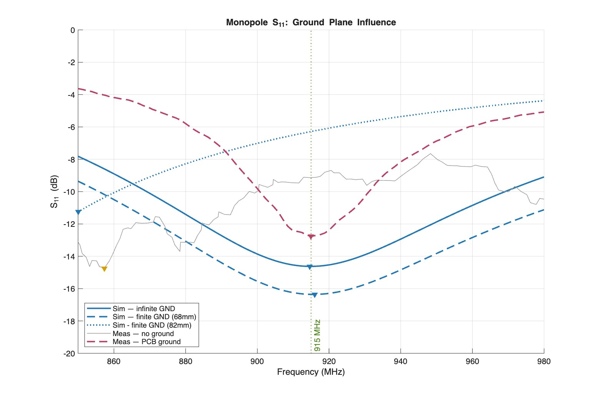
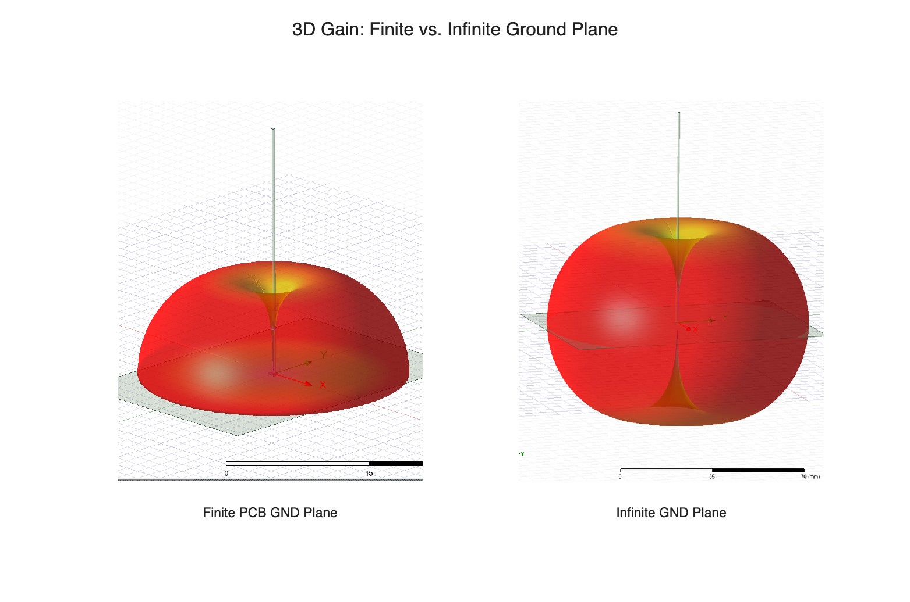

# ARV E-Stop Transmitter PCB
**University of Michigan — ARV Project Team**  
Custom 2-layer PCB for wireless emergency stop (E-Stop) transmitter

---

## Overview

This board implements a handheld wireless E-Stop transmitter for the ARV autonomous robot platform. It interfaces an ESP32 microcontroller with a 900MHz LoRa radio module to transmit an emergency stop signal over >100m range. A switch triggers the E-Stop event, and an LED provides visual status feedback.



---

## Software

### ROS2 Interface
Connected to `embedded_ros_marvin` via serial bridge.

ESP32 → UART serial → serial monitor script → `/tmp/estop_value.txt` → ROS2 `/estop` topic
- **Code** placed in: 

## Hardware

### Why These Parts
- **LoRa (SX1276):** 900MHz, >1km range, low power — chosen over
  WiFi/BT for reliability in outdoor competition environments
- **ESP32:** handles LoRa SPI + ROS2 serial bridge in one package,
  onboard WiFi useful for debugging

| Component | Part | Description |
|---|---|---|
| Microcontroller | ESP32 (via pin headers) | Main controller, SPI master |
| LoRa Radio | Adafruit RFM9x Breakout | 900MHz LoRa transceiver |
| Antenna | TI 915MHz (TI.92.2113) | Omnidirectional 915MHz antenna via SMA |
| Switch | Omron B3F-1000 | Tactile E-Stop trigger |
| Status LED | 3mm LED | Visual power/status indicator |
| Current Limiting Resistor | 220Ω metal film | LED current limiting |
| PCB | 2-layer FR4, 1.6mm, (Top signal + Bottom GND plane) | JLCPCB fabrication |

---
## Mechanical

- All mounting holes: #4-40, 3.175mm diameter.
- See `Project Outputs/~.dxf` for dimensions.
---

## Pin Mapping

### ESP32 → LORA-R (RFM9x)

| ESP32 Pin | LoRa Pin | Function |
|---|---|---|
| GPIO (SCK) | SCK | SPI Clock |
| GPIO (MISO) | MISO | SPI Data In |
| GPIO (MOSI) | MOSI | SPI Data Out |
| GPIO (CS) | CS | Chip Select |
| GPIO | RST | Reset |
| GPIO | G0 | DIO0 / Interrupt |
| 3.3V | VIN | Power |
| GND | GND | Ground |



---

## Design Considerations

**RF / Antenna**
- The TI 915MHz monopole is mounted vertically (perpendicular to PCB) at the board edge, fed via SMA directly on the Adafruit RFM9x breakout. The Adafruit breakout handles all internal RF routing and matching to the RFM9x; no additional matching network required.
- With the monopole vertical over the bottom ground plane, image theory applies: the ground plane acts as an infinite conductor mirror, making the monopole electrically equivalent to a half-wave dipole radiating broadside in the upper hemisphere. Effective ground plane extent from the antenna feed point is approximately 100mm, exceeding the λ/4 requirement at 915MHz (~82mm).
- ESP32 module includes a meander-line Inverted F-antenna(IFA) for 2.4GHz WiFi/BT. 
- Co-existence with the 915MHz LoRa antenna is not a concern: the ~800MHz frequency separation (frees from near-field coupling) and the IFA's horizontal radiation geometry is orthogonal to the vertically-polarised monopole.

**Ground Plane**
- Solid copper pour on bottom layer serves dual purpose: general signal integrity and as the image plane for the 915MHz monopole.
- Thermal reliefs on GND through-hole pads for solderability.
- Ground plane removed on in the manufacturer-specified keepout region around the ESP32 WiFi antenna to prevent detuning of the module's integrated IFA matching network.

**Power**
- Both the ESP32 and LoRa module are powered from the onboard 3.3V regulator via VIN. 

**LED Circuit**
- GPIO → 220Ω (R1) → LED anode → LED cathode → GND
- At 3.3V supply with 2.0V LED forward voltage: $I = \frac{3.3-2.0}{220} \approx 5.9\text{mA}$
- Within operating range for standard 3mm LED (20mA max)

---

## Antenna Validation



Three ground conditions were measured/simulated to validate the PCB ground plane design:
- **No Ground Plane** — resonance shifts down to 856.5 MHz due to uncontrolled 
  common-mode return current on the coax outer conductor, which extends the effective 
  radiating length beyond the physical antenna: $L_{\text{eff}} = L_{\text{ant}} + \Delta L_{\text{coax}}$
- **PCB Ground Plane** — resonance recovers to 915.0 MHz, confirming the ~100mm 
  ground plane extent is sufficient for proper monopole operation
- **HFSS Infinite Ground Plane** — Provides a theoretical benchmark for $S_{11}$ depth;
  the alignment in resonant frequency with the PCB result validates the finite ground approximation.

### Far-Field Radiation Pattern



The ground plane reflects the monopole's radiation into the upper hemisphere 
via image theory. In the far-field, edge diffraction allows radiation to wrap 
around the finite PCB, causing the system to behave as an effective asymmetric dipole.

## Expected Performance

| Metric | Expected Value |
|---|---|
| Operating Frequency | 915 MHz |
| Modulation | LoRa (chirp spread spectrum) |
| Typical Range (open field) | 300m – 1km depending on spreading factor |
| Supply Voltage | 3.3V |
| LED Current | ~6mA |
| Board Dimensions | ~100x60mm |

> **Note:** Actual range dependent on firmware spreading factor, transmit power settings, and environment. LoRa range degrades significantly in urban/indoor environments with multipath interference.

---

## Repository Structure

```
arv-e_stop-pcb/
├── transmitter.SchDoc        # Altium schematic
├── transmitter.PcbDoc        # Altium PCB layout
├── lora_transmitter.PrjPcb   # Altium project file
├── Project Outputs/          # Generated Gerber + drill files
│   ├── Gerber/
│   └── NC Drill/
└── README.md
```

---

## Credits

- **ARV Project Team — University of Michigan**
- Contributors :  [@yourusername](https://github.com/yourusername)
- Developed: September 2025 - March 2026
- Last Modified: March 14, 2026

---

## License

MIT license for redistribution. 
